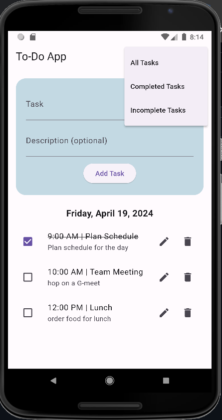

# To-Do App [XOVEX Task]

This is a simple To-Do application built with flutter with the following features:

1. Add tasks with a title and optional description.
2. Mark tasks as completed.
3. Edit existing tasks.
4. Delete tasks.
5. View a list of all tasks, with completed tasks visually differentiated (crossed off ).
6. Filter tasks based on their completion status (completed/incomplete).
7. Displays current Date

## Getting started

To setup this app you will need to have Flutter SDK installed and have to import intl package for date formatting. to run the application just run the following command in the project directory when the emulator is running for testing Nexus 7 emulator was used.

```bash
flutter run
```
and you also have to unstall the following package for current Date:

```bash
flutter pub get table_calendar
```


## Preview 




## Additional Information

This project is a starting point for a Flutter application.

A few resources to get you started if this is your first Flutter project:

- [Lab: Write your first Flutter app](https://docs.flutter.dev/get-started/codelab)
- [Cookbook: Useful Flutter samples](https://docs.flutter.dev/cookbook)

For help getting started with Flutter development, view the
[online documentation](https://docs.flutter.dev/), which offers tutorials,
samples, guidance on mobile development, and a full API reference.

## Authors

Kaushal G | @kaushalg47
